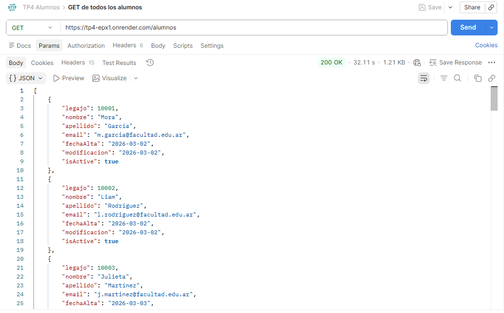
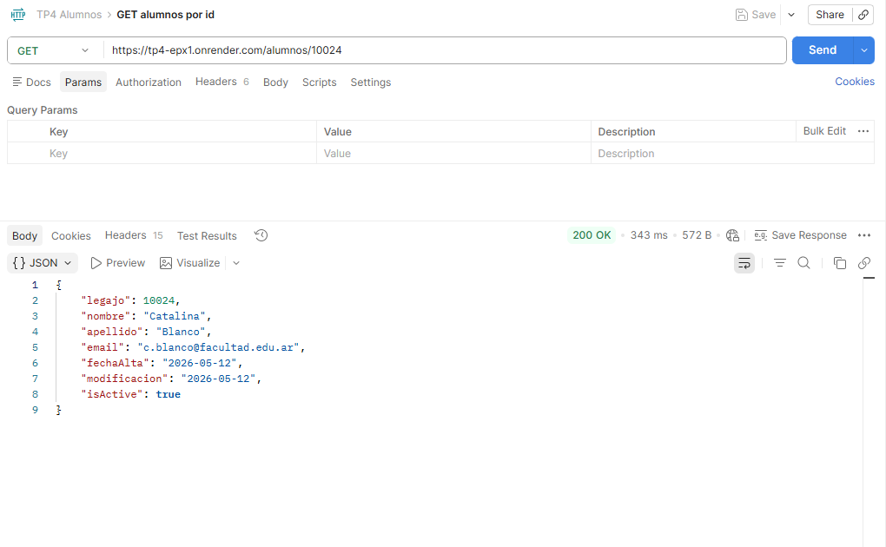
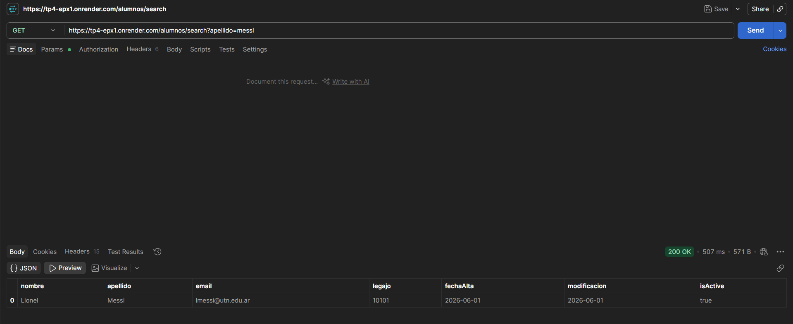
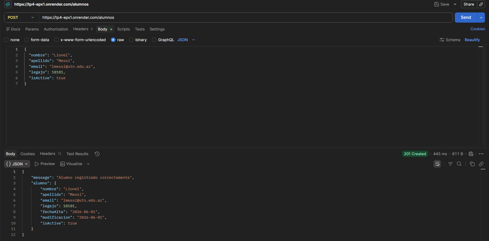
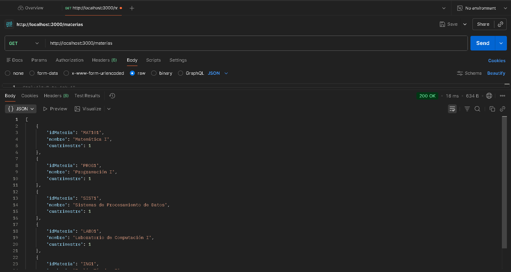
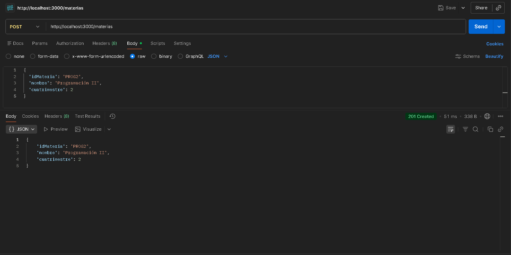

# Documentación #
### El archivo README.md debe incluir lo siguiente: ###
- Número de grupo e integrantes.
- Nombre del proyecto y su descripción.
- Metodología de trabajo con Git y GitHub.
- División de los archivos entre los integrantes.
- Distribución de los archivos y carpetas.
- Un 90% de las funciones explicadas a detalle.
- Documentación con ‘Postman’ de todos los métodos (GET, PUT, DELETE, POST).
- Mínimo un ejemplo de la estructura de cada archivo JSON utilizado (no integrar varios “arrays” en un mismo archivo).
- Link del deploy en Render.
- Link al repositorio con el front-end.


Implentacion de NOTAS - Valentina Guerrieri
hice el GET/notas que obtiene las notas alamcenadas en data/extras/sys-notas.json, con la funcion getNotAll. 

Esto significa que lee el archivo sys-notas.json, convierte el contendio JSON a un arreglo de objetos y devuelve todas las notas registradas.
También implemente el endpoint POST /notas, que permite agregar una nueva nota al sistema mediante la funcion postNota.

Esta función lee el archivo sys-notas.json, obtiene los datos enviados en req.body, genera un nuevo identificador, agrega la nueva nota al arreglo, guarda los cambios en el archivo JSON y devuelve la nota creada
Pruebas realizadas

Los endpoints fueron probados mediante Postman.

GET/notas
Respuesta exitosa: 200 OK
Devuelve todas las notas registradas.
POST /notas
Respuesta exitosa: 201 Created
Agrega una nueva nota y devuelve el objeto creado.

ejemplo de registro:

{
  "id": 1,
  "legajo": 10001,
  "idMateria": "MAT101",
  "nota": 9,
  "fecha": "03-04-24"
}
# Trabajo Práctico N°4: Consumo de APIs, Arquitectura MVC, Gestión de Datos y Deploys

Proyecto de desarrollo web para el **Trabajo Práctico N°4** de Programación III. Esta etapa constituye un sistema completo de gestión de alumnos mediante una **API REST** construida con Node.js, Express y TypeScript. La API se encuentra desplegada en **Render** para acceso remoto y utiliza arquitectura MVC con persistencia de datos en archivos JSON locales.

---

## 🚀 Descripción del Proyecto

La API está construida sobre el entorno de **Node.js** utilizando el framework **Express** versión 5.2, con gestión de dependencias mediante **NPM**. Se aplican conceptos avanzados de **Programación Orientada a Objetos (POO)** integrando **TypeScript**, permitiendo definir clases especializadas para cada entidad (Alumno, Profesor, Materia) e implementar validaciones robustas de datos ingresados.

### Objetivos Principales

1. **Independizar la interfaz de usuario** del almacenamiento de datos estáticos
2. **Centralizar la gestión de información** mediante endpoints REST
3. **Persistir y consultar registros** utilizando archivos JSON como base de datos simulada
4. **Implementar arquitectura MVC** separando controladores, modelos y rutas
5. **Permitir acceso remoto** mediante despliegue en plataformas como Render
6. **Validar datos** de forma defensiva en todos los endpoints

---

## 👥 Grupo 16 - Integrantes y División de Tareas

- **Priscila Arrimada:** `DELETE/alumnos/:id`.
- **Tomás Astudillo:** `PUT/alumnos/:id`.
- **Valentina Guerrieri:** `GET/notas`, `POST/notas`.
- **Máximo Messina:** `POST/alumnos`, `GET/alumnos/search`.
- **Máximo Moraes:** `GET/alumnos`, `GET/alumnos/:id`.
- **Lucas Rojas:** `GET/materias`, `POST/materias`.

---

## 📁 Distribución de Archivos y Carpetas

```text
📁 TP4/
├── 📁 controllers/         # Lógica de procesamiento de peticiones HTTP
│   └── alumno.controller.js
├── 📁 core/                # Configuración central del servidor
│   └── server.js
├── 📁 data/                # Base de datos simulada (archivos JSON)
│   ├── alumnos.json
│   └── extras/
│       ├── sys-materias.json
│       ├── sys-profesores.json
│       └── sys-notas.json
├── 📁 models/              # Clases POO y lógica de modelos
│   ├── alumno.model.ts
│   ├── persona.model.ts
│   └── extras/
│       ├── clase.model.ts
│       ├── nota.model.ts
│       └── profesor.model.ts
├── 📁 persistence/         # Capa de persistencia y base de datos fake (no utilizada por ahora)
│   └── sys-databse-models/
│       ├── sys-fake-database.model.ts
│       └── sys-log.database.model.ts
├── 📁 routes/              # Definición y mapeo de endpoints REST
│   ├── alumno.routes.js
│   └── extras/
│       ├── materia.routes.js
│       ├── nota.routes.js
│       └── profesor.routes.js
├── 📁 docs/                # Documentación adicional
├── 📄 .env                 # Variables de entorno (puerto, configuraciones)
├── 📄 .gitignore           # Archivos excluidos de versionado
├── 📄 .dockerignore        # Archivos excluidos de imagen Docker
├── 📄 Dockerfile           # Configuración para containerización
├── 📄 app.js               # Punto de entrada principal de la aplicación
├── 📄 tsconfig.json        # Configuración del compilador TypeScript
├── 📄 package.json         # Metadatos, dependencias y scripts NPM
├── 📄 package-lock.json    # Árbol de dependencias bloqueado
└── 📄 README.md            # Documentación técnica principal
```

---

## 🛠️ Metodología de Trabajo con Git y GitHub

El equipo implementó un flujo de trabajo estructurado basado en ramas:

1. **Ramas Principales**

- **`main`:** Rama exclusiva para versiones estables y aptas para entrega final
- **`dev`:** Rama de integración central para pruebas previas al redespliegue

2. **Ramas Personales**
   Cada integrante desarrolló sus asignaciones en una rama personal aislada, utilizando nomenclatura estándar: `alumno-apellido`.

3. **Flujo de Integración**
   Todo código nuevo o modificado requirió de la generación de _commits_ atómicos y descriptivos. Para unificar los cambios, cada desarrollador abrió un **Pull Request** hacia las ramas de integración (`dev`/`main`), permitiendo la revisión del código por parte del equipo y garantizando una resolución prolija de conflictos antes de ejecutar la mezcla definitiva (_merge_).

---

## 📡 Endpoints Implementados

### Alumnos

#### `GET /alumnos`

**Descripción:** Obtiene la lista completa de todos los alumnos registrados.



#### `GET /alumnos/:legajo`

**Descripción:** Obtiene los datos de un alumno específico mediante su legajo.



#### `GET /alumnos/search`

**Descripción:** Búsqueda filtrada de alumnos por apellido y/o estado activo.



---

#### `POST /alumnos`

**Descripción:** Registra un nuevo alumno en el sistema.



---

### Materias

#### `GET /materias`

**Descripción:** Obtiene la lista completa de todas las materias registradas en el sistema.



---

#### `POST /materias`

**Descripción:** Registra una nueva materia en el sistema.



---

## 📂 Estructura de Archivos JSON

### Alumnos (`data/alumnos.json`)

```json
[
  {
    "legajo": 10001,
    "nombre": "Mora",
    "apellido": "García",
    "email": "m.garcia@facultad.edu.ar",
    "fechaAlta": "2026-03-02",
    "modificacion": "2026-03-02",
    "isActive": true
  }
]
```

---

## 🔧 Explicación de Funciones Principales

### Controllers/Alumnos

#### `getAlumnoAll()`

Función **asíncrona** que lee el archivo `alumnos.json` mediante el módulo `fs.promises`. Implementa un bloque `try/catch` para manejo defensivo de errores. Convierte el contenido del archivo (formato texto) a objeto JavaScript mediante `JSON.parse()` y lo devuelve al cliente con código HTTP `200`. Si falla la lectura del archivo, captura la excepción y retorna estado `500`.

---

#### `getAlumnoById()`

Intercepta petición GET y extrae el parámetro dinámico `legajo` desde `req.params`. Utiliza el método `.find()` para buscar coincidencia exacta en el array de alumnos. Convierte el parámetro a número con `Number()` para validación segura. Si el alumno existe, retorna sus datos con estado `200`; si no existe, responde con `404 Not Found`.

---

#### `postAlumno()`

Procesa el registro de nuevos alumnos mediante `POST`. Verifica que todos los campos obligatorios estén presentes (si no lo están, retorna `400`), valida que el legajo no exista previamente (si no retorna `409`), genera fecha de alta automáticamente con la fecha actual en formato ISO, instancia la clase `AlumnoModel` con los datos validados, obtiene atributos del objeto mediante `getAllAttributes()`, agrega el nuevo alumno al array y persiste los cambios reescribiendo el archivo con `fs.writeFile()`.
Si el alumno se registra exitosamente retorna `201`, si hay error de por medio retorna `500`.

---

#### `getAlumnoBySearch()`

Implementa búsqueda con múltiples criterios. Lee el archivo de alumnos y aplica filtros secuenciales:

- **Si se proporciona `apellido`:** Filtra alumnos cuyo apellido contiene el texto ingresado (búsqueda case-insensitive)
- **Si se proporciona `isActive`:** Convierte el string `'true'`/`'false'` a booleano y filtra por estado

Los filtros se aplican de forma **AND** (ambos condiciones deben cumplirse si se proporcionan ambos). Retorna array con coincidencias (vacío si no hay resultados). Registra en consola la cantidad de resultados encontrados y retorna `200`. Si falla la lectura del archivo, captura la excepción y retorna estado `500`.

---

### Controllers/Materias

#### `getMaterias()`

Función **asíncrona** que obtiene la lista completa de materias. Lee el archivo `sys-materias.json` ubicado en la carpeta `extras` utilizando `fs.promises` para operaciones de lectura de forma no bloqueante. Implementa un bloque `try/catch` para manejo defensivo de errores. Convierte el contenido del archivo (formato texto) a objeto JavaScript mediante `JSON.parse()` y devuelve el array completo de materias al cliente con código HTTP `200`. Si falla la lectura del archivo, captura la excepción y retorna estado `500`.

---

#### `postMateria()`

Procesa el registro de nuevas materias mediante `POST`. Realiza validación defensiva verificando que todos los campos obligatorios (`idMateria`, `nombre`, `cuatrimestre`) estén presentes en el cuerpo de la solicitud; si falta alguno, retorna `400 Bad Request`. Lee el archivo `sys-materias.json`, utiliza el método `.find()` para verificar si el `idMateria` ya existe en el sistema; en caso afirmativo, retorna `409 Conflict` indicando duplicación. Agrega la nueva materia al array y persiste los cambios reescribiendo el archivo con `fs.writeFile()`. Si la materia se registra exitosamente, retorna `201 Created` con el objeto creado; si ocurre cualquier otro error durante el proceso, captura la excepción y retorna estado `500`.

---
